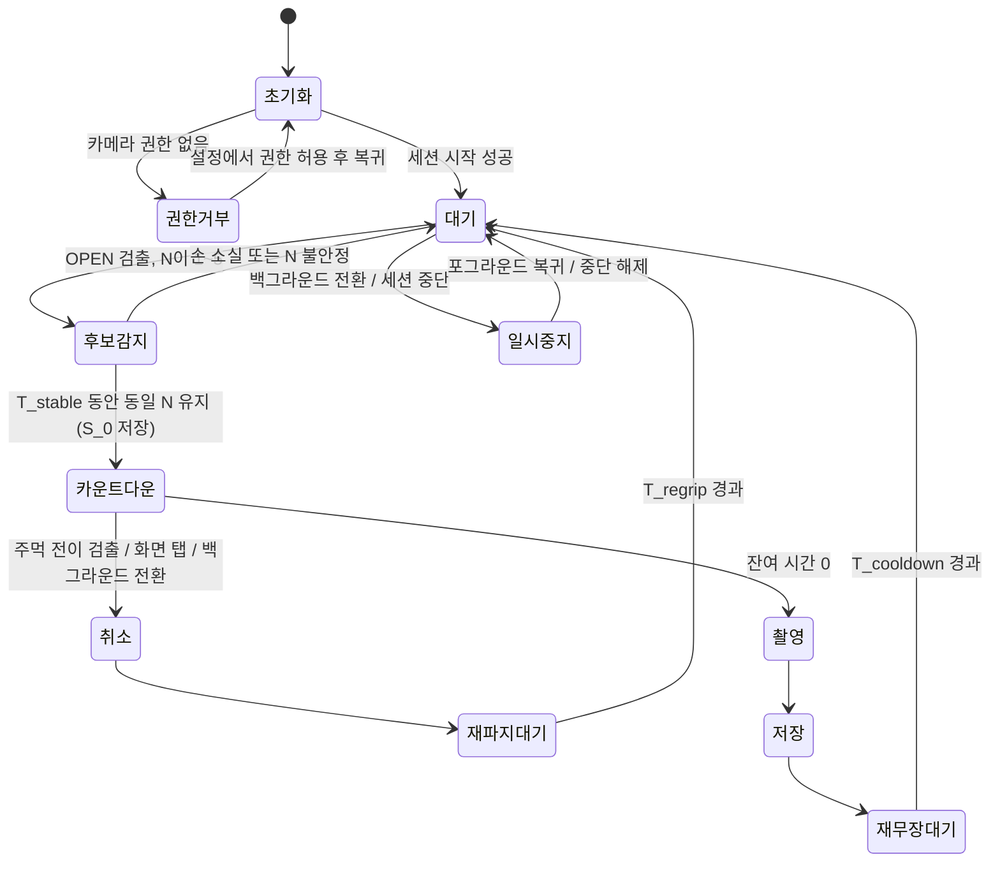

# HiHelloCamera 소프트웨어 요구사항 명세서 (SRS)

| 항목 | 내용 |
| --- | --- |
| 제품명 | HiHelloCamera (Finger Sign Timer Camera) |
| 문서 버전 | 0.2 (초안) |
| 작성일 | 2026-09-09 |
| 작성자 | YoungH.Kim |
| 대상 플랫폼 | iOS (iPhone) |
| 상태 | 검토 대기 |

---

## 1. 서론

### 1.1 목적

본 문서는 카메라 프리뷰에 잡힌 피사 인물의 **펴진 손가락 개수를 인식**하여, 그 개수에 대응하는 **셀프 타이머로 자동 촬영**하는 iPhone 애플리케이션 `HiHelloCamera`의 소프트웨어 요구사항을 정의한다.
개발자, 테스터, 기획 검토자가 공통의 기준으로 구현 범위와 인수 조건을 판단하는 데 사용한다.

### 1.2 문서 범위

- 포함: iOS 네이티브 앱의 카메라 캡처, 온디바이스 손 자세 인식, 손가락 개수 판정, 카운트다운 타이머, 사진 촬영/저장, 설정, 권한 처리.
- 제외: 서버/백엔드, 계정 시스템, 클라우드 동기화, 사진 편집·필터, 동영상 촬영, iPad 전용 레이아웃, watchOS 연동.

### 1.3 용어 정의 및 약어

| 용어 | 정의 |
| --- | --- |
| 손 자세 인식 (Hand Pose) | 영상 프레임에서 손의 관절 landmark 좌표를 추정하는 기능 |
| 펴진 손가락 (Extended Finger) | 손가락 관절 상태가 "펴짐"으로 판정된 손가락 |
| 제스처 개수 N | 대상 손에서 판정된 펴진 손가락 개수 (0~5) |
| 안정화 시간 `T_stable` | 동일한 N이 연속 유지되어야 트리거가 확정되는 시간 |
| 카운트다운 | 촬영까지 남은 시간을 화면·소리·햅틱으로 알리는 구간 |
| 재무장 대기 `T_cooldown` | 촬영 직후 재트리거를 막는 대기 구간 |
| 대상 손 (Target Hand) | 여러 손이 검출될 때 트리거 판정에 사용하는 단 하나의 손 |
| FPS | Frames Per Second |
| MVP | Minimum Viable Product, 최초 출시 범위 |

### 1.4 참조 문서

| ID | 문서 |
| --- | --- |
| REF-1 | Apple AVFoundation Capture 프로그래밍 가이드 |
| REF-2 | Apple Vision — Human Hand Pose Detection |
| REF-3 | Apple PhotoKit (Photos / PhotosUI) |
| REF-4 | Apple Human Interface Guidelines — Camera, Accessibility, Haptics |
| REF-5 | App Store Review Guidelines (5.1 Privacy) |
| REF-6 | 저장소 현재 스캐폴드: `HiHelloCamera.xcodeproj`, `HiHelloCamera/*` |

### 1.5 요구사항 표기 규칙

- 식별자: `FR-<영역>-<번호>` (기능), `NFR-<영역>-<번호>` (비기능).
- 우선순위: **M**(Must, MVP 필수) / **S**(Should, 권장) / **C**(Could, 선택).
- 검증 방법: **I**(검사, Inspection) / **D**(시연, Demonstration) / **T**(시험, Test) / **A**(분석, Analysis).
- "~해야 한다"는 필수, "~할 수 있다"는 선택 사항을 뜻한다.

---

## 2. 시스템 개요

### 2.1 제품 관점

독립 실행형 iOS 앱이며 외부 서버에 의존하지 않는다. 현재 저장소에는 UIKit + Storyboard 기반의 빈 앱 스캐폴드만 존재한다.

| 항목 | 현재 값 |
| --- | --- |
| 번들 ID | `youngh.HiHelloCamera` |
| 배포 타깃 | iOS 26.5 |
| UI 프레임워크 | UIKit + Storyboard (`Main.storyboard`, `ViewController.swift`) |
| Swift 버전 | 5.0 |
| 디바이스 패밀리 | 1,2 (iPhone/iPad) → **본 SRS는 iPhone(1)으로 한정할 것을 요구** (FR-ENV-001) |

### 2.2 주요 기능 요약

1. 카메라 프리뷰를 실시간 표시한다.
2. 프리뷰 프레임에서 손을 검출하고 펴진 손가락 개수 N을 판정한다.
3. N이 `T_stable` 동안 안정적으로 유지되면 해당 개수에 매핑된 초 수로 카운트다운을 시작한다.
4. 카운트다운을 화면·소리·햅틱으로 안내하고, 0이 되면 사진을 촬영한다.
5. 촬영 결과를 사진 라이브러리에 저장하고 썸네일로 확인시킨다.
6. 사용자는 매핑 규칙, 안내음, 연사, 카메라 방향 등을 설정할 수 있다.

### 2.3 사용자 특성

| 사용자 | 특성 | 요구 |
| --- | --- | --- |
| 일반 사용자 | 셀프 촬영/단체 촬영을 하는 일반인. 촬영 시 기기와 1~3 m 떨어져 있음 | 손만으로 조작 가능해야 함 |
| 접근성 사용자 | VoiceOver 사용, 저시력, 청각 제약 | 시각/청각/촉각 중 하나만으로 카운트다운 인지 가능해야 함 |
| 개발/QA | 인식 파라미터 튜닝 필요 | 진단 오버레이 제공(디버그 빌드 한정) |

### 2.4 운영 환경

| 항목 | 요구 |
| --- | --- |
| 디바이스 | iPhone (A16 Bionic 이상 권장, 최소 A14) |
| OS | iOS 26.5 이상 |
| 하드웨어 | 전/후면 카메라, Neural Engine, Taptic Engine, 스피커 |
| 네트워크 | 불필요 (완전 오프라인 동작) |
| 방향 | 세로(Portrait) 기본, 가로 지원은 S 등급 |

### 2.5 제약사항

| ID | 제약 |
| --- | --- |
| CON-01 | 모든 영상 분석은 **온디바이스**에서 수행하며 프레임을 외부로 전송하지 않는다. |
| CON-02 | 손 인식은 Apple Vision 프레임워크의 손 자세 인식 기능을 사용한다. 서드파티 ML 런타임 도입은 별도 승인 대상이다. |
| CON-03 | 카메라·사진 접근은 iOS 권한 모델을 따르며, 권한 거부 시 대체 동작을 제공해야 한다. |
| CON-04 | 프리뷰 프레임은 디스크에 저장하지 않는다(메모리 내 처리 후 폐기). |
| CON-05 | App Store 심사 정책상 카메라/사진 사용 목적을 `Info.plist`에 명시해야 한다. |

### 2.6 가정 및 의존성

- 촬영 대상 인물은 손바닥(또는 손등)을 카메라 방향으로 향한 상태로 손가락을 편다.
- 조도는 실내 일반 조명(약 100 lux) 이상을 가정한다. 그 이하에서는 인식률 저하를 허용한다.
- 손 인식 정확도는 iOS Vision 프레임워크 성능에 종속된다.

### 2.7 릴리스 범위

| 범위 | 포함 요구사항 |
| --- | --- |
| MVP (v1.0) | 우선순위 **M** 요구사항 전체 |
| v1.1 이후 | 우선순위 **S**, **C** 요구사항 (연사, 가로 모드, 사용자 지정 매핑, 진단 오버레이 등) |

---

## 3. 외부 인터페이스 요구사항

### 3.1 사용자 인터페이스

#### 3.1.1 화면 목록

| 화면 ID | 이름 | 설명 |
| --- | --- | --- |
| SCR-01 | 카메라 화면 | 앱 진입 시 기본 화면. 프리뷰 + 상태 표시 + 컨트롤 |
| SCR-02 | 권한 안내 화면 | 카메라/사진 권한 미허용 시 표시 |
| SCR-03 | 설정 화면 | 매핑/안내음/연사/저장 옵션 |
| SCR-04 | 촬영 결과 확인 | 최근 촬영 썸네일 및 전체 보기 |
| SCR-05 | 도움말/사용법 | 최초 실행 시 제스처 사용법 온보딩 |

#### 3.1.2 SCR-01 카메라 화면 구성 요소

| 요소 | 설명 | 관련 요구사항 |
| --- | --- | --- |
| 프리뷰 레이어 | 전체 화면 카메라 영상 | FR-CAM-001 |
| 상태 배지 | "손을 보여주세요" / "3초 인식됨" / "촬영 중" | FR-UI-001 |
| 카운트다운 표시 | 화면 중앙 대형 숫자 + 원형 진행 링 | FR-TMR-004 |
| 손 인식 표시 | 검출된 대상 손 위치에 반투명 마커와 개수 뱃지 | FR-UI-002 |
| 셔터 버튼 | 수동 촬영 | FR-CAP-004 |
| 카메라 전환 버튼 | 전/후면 전환 | FR-CAM-004 |
| 플래시 버튼 | auto/on/off | FR-CAM-005 |
| 설정 버튼 | SCR-03 진입 | FR-SET-001 |
| 최근 썸네일 | SCR-04 진입 | FR-SAV-004 |

#### 3.1.3 UI 규칙

| ID | 요구사항 | 우선 | 검증 |
| --- | --- | --- | --- |
| FR-UI-001 | 앱은 현재 상태(대기/인식중/카운트다운/촬영/저장)를 화면 상단 상태 배지 텍스트로 항상 표시해야 한다. | M | D |
| FR-UI-002 | 대상 손이 검출된 동안 해당 손의 화면 위치에 인식 마커와 판정된 개수 N을 표시해야 한다. | M | D |
| FR-UI-003 | 카운트다운 잔여 시간은 1초 단위로 갱신되며, 마지막 3초 구간은 시각적으로 강조(색상 변화·확대)해야 한다. | M | D |
| FR-UI-004 | 카운트다운 중 화면 어디든 탭하면 취소되며, 취소 사실을 텍스트로 알려야 한다. | M | T |
| FR-UI-005 | 최초 실행 시 SCR-05 온보딩을 1회 표시하고, 설정에서 다시 볼 수 있어야 한다. | S | D |
| FR-UI-006 | 디버그 빌드에서 손 landmark, 판정 근거, 처리 FPS를 표시하는 진단 오버레이를 제공할 수 있다. | C | I |
| FR-UI-007 | 카운트다운 중 대상 손이 추적되고 있는 동안에는 "주먹을 쥐면 취소" 힌트를 표시해야 한다. 추적을 잃으면 "화면을 탭하면 취소"로 문구를 전환한다(FR-TRG-012). | M | D |
| FR-UI-008 | 취소가 확정되면 즉시 햅틱(경고 패턴) 1회와 함께 "촬영 취소됨"을 2초간 표시하고, 카운트다운 숫자를 소거해야 한다. | M | D |

### 3.2 하드웨어 인터페이스

| ID | 요구사항 | 우선 | 검증 |
| --- | --- | --- | --- |
| FR-HW-001 | 전면·후면 카메라를 모두 사용할 수 있어야 하며, 기본은 **전면 카메라**이다. | M | D |
| FR-HW-002 | 카운트다운 이벤트에 Taptic Engine 햅틱 피드백을 사용해야 한다. | M | D |
| FR-HW-003 | 스피커를 통해 카운트다운 비프음/셔터음을 출력해야 한다. | M | D |
| FR-HW-004 | 무음 모드에서도 법규가 요구하는 지역에서는 셔터음을 억제하지 않는다(시스템 기본 동작 준수). | M | I |

### 3.3 소프트웨어 인터페이스

| 구성 요소 | 사용 목적 |
| --- | --- |
| AVFoundation | `AVCaptureSession`, `AVCaptureDeviceInput`, `AVCaptureVideoPreviewLayer`, `AVCaptureVideoDataOutput`(분석용 프레임), `AVCapturePhotoOutput`(정지영상 촬영) |
| Vision | 손 자세 인식 요청 및 관절 landmark 추출 |
| Photos (PhotoKit) | 촬영 결과를 사진 라이브러리에 저장 |
| CoreHaptics / UIFeedbackGenerator | 카운트다운 햅틱 |
| AVFAudio | 카운트다운 비프음, 음성 안내 |
| UIKit | 화면 구성 (현행 스캐폴드 유지) |
| Foundation `UserDefaults` | 설정값 영속화 |

### 3.4 통신 인터페이스

| ID | 요구사항 | 우선 | 검증 |
| --- | --- | --- | --- |
| FR-NET-001 | 앱은 어떠한 네트워크 통신도 수행하지 않아야 한다(분석/광고/크래시 리포트 포함, 별도 승인 전까지). | M | A |

---

## 4. 기능 요구사항

### 4.1 권한 및 초기화 (FR-PRM)

| ID | 요구사항 | 우선 | 검증 |
| --- | --- | --- | --- |
| FR-PRM-001 | 앱은 카메라 화면 최초 진입 시 카메라 권한(`AVCaptureDevice.authorizationStatus`)을 확인하고, 미결정 상태이면 권한을 요청해야 한다. | M | T |
| FR-PRM-002 | `Info.plist`에 `NSCameraUsageDescription`, `NSPhotoLibraryAddUsageDescription`을 한국어/영어로 명시해야 한다. | M | I |
| FR-PRM-003 | 카메라 권한이 거부/제한된 경우 SCR-02를 표시하고, 설정 앱으로 이동하는 버튼을 제공해야 한다. | M | T |
| FR-PRM-004 | 사진 라이브러리 추가 권한은 **최초 저장 시점**에 요청해야 한다(앱 시작 시 선요청 금지). | M | T |
| FR-PRM-005 | 사진 권한 거부 시에도 촬영은 가능해야 하며, 결과를 앱 내 임시 보관 후 공유 시트로 내보낼 수 있어야 한다. | S | T |
| FR-PRM-006 | 앱은 마이크·위치·연락처 등 불필요한 권한을 요청하지 않아야 한다. | M | I |

### 4.2 카메라 프리뷰 및 제어 (FR-CAM)

| ID | 요구사항 | 우선 | 검증 |
| --- | --- | --- | --- |
| FR-CAM-001 | 앱은 실시간 카메라 프리뷰를 전체 화면(aspect fill)으로 표시해야 한다. | M | D |
| FR-CAM-002 | 캡처 세션은 사진 촬영과 프레임 분석을 동시에 지원해야 한다(`AVCapturePhotoOutput` + `AVCaptureVideoDataOutput` 동시 연결). | M | T |
| FR-CAM-003 | 캡처 세션 구성 및 시작은 메인 스레드가 아닌 전용 직렬 큐에서 수행해야 한다. | M | I |
| FR-CAM-004 | 사용자는 전/후면 카메라를 전환할 수 있어야 하며, 전환 중에도 앱이 응답 불가 상태가 되지 않아야 한다. | M | T |
| FR-CAM-005 | 플래시 모드(auto/on/off)를 선택할 수 있어야 하며, 선택값은 앱 재실행 후에도 유지되어야 한다. | S | T |
| FR-CAM-006 | 전면 카메라 촬영 결과는 프리뷰와 좌우 방향이 일치해야 한다(미러링 정책은 설정으로 선택 가능). | S | T |
| FR-CAM-007 | 전화 수신, 다른 앱의 카메라 점유 등으로 세션이 중단되면(`AVCaptureSessionWasInterrupted`) 사용자에게 알리고, 중단 해제 시 자동 복구해야 한다. | M | T |
| FR-CAM-008 | 앱이 백그라운드로 전환되면 캡처 세션을 중지하고, 포그라운드 복귀 시 재개해야 한다. | M | T |
| FR-CAM-009 | 프리뷰 탭으로 초점/노출을 조정할 수 있다. | C | D |

### 4.3 손 검출 및 손가락 개수 인식 (FR-DET)

| ID | 요구사항 | 우선 | 검증 |
| --- | --- | --- | --- |
| FR-DET-001 | 앱은 프리뷰 프레임에서 사람의 손을 검출하고 관절 landmark를 추출해야 한다. | M | T |
| FR-DET-002 | 프레임 분석 주기는 최대 15 FPS로 제한하고(설정 가능 범위 10~20), 처리 지연 시 프레임을 드롭해야 한다(`alwaysDiscardsLateVideoFrames = true`). | M | T |
| FR-DET-003 | 분석은 프리뷰 렌더링과 분리된 백그라운드 큐에서 수행하여, 프리뷰가 30 FPS 미만으로 떨어지지 않아야 한다. | M | T |
| FR-DET-004 | 각 손가락(엄지, 검지, 중지, 약지, 소지)에 대해 "펴짐/접힘"을 판정하고, 프레임별 결과를 `OPEN(N=1~5)` / `CLOSED(주먹)` / `UNDETERMINED(판정 불가)` 중 하나로 출력해야 한다. 판정 알고리즘은 부록 A를 따른다. | M | T |
| FR-DET-005 | landmark 신뢰도가 임계값 `C_min` 미만인 관절이 있는 손가락은 펴짐 판정에서 제외한다. 신뢰 가능한 손가락이 3개 미만이면 `OPEN` 판정을 내리지 않되, 손목·MCP 신뢰도가 `C_palm` 이상이면 프레임을 폐기하지 말고 FR-DET-012의 주먹 판정으로 전달해야 한다. 두 판정이 모두 실패한 경우에만 `UNDETERMINED`로 처리한다. | M | T |
| FR-DET-006 | 손 bounding box의 면적이 프레임 면적의 `A_min` 미만이면(너무 멀거나 작음) 무시해야 한다. | M | T |
| FR-DET-007 | 동시에 여러 손이 검출되면, ① 화면 중앙에 가까움 ② bounding box 면적이 큼 ③ 신뢰도가 높음 순의 가중 점수로 **대상 손 1개**만 선택해야 한다. | M | T |
| FR-DET-008 | 대상 손은 프레임 간 위치 연속성을 기준으로 추적하여, 다른 손으로 임의 전환되지 않아야 한다. | S | T |
| FR-DET-009 | 좌/우 손, 손바닥/손등 방향, 화면 내 ±30° 회전에 대해 동일한 N을 산출해야 한다. | M | T |
| FR-DET-010 | 인식 대상은 최대 2개 손까지 검출하도록 요청 파라미터를 설정하여 연산량을 제한해야 한다. | S | I |
| FR-DET-011 | 조도 부족 등으로 3초 이상 손이 검출되지 않으면 "손이 보이지 않습니다" 안내를 표시해야 한다. | S | D |

#### 4.3.1 주먹(폐쇄 손) 판정 — 취소 제스처용

> 근거 및 타당성 평가는 **부록 D**를 참조한다. 주먹은 손가락 끝점이 자기 폐색(self-occlusion)되어 개수 세기 파이프라인으로는 안정적으로 판정할 수 없으므로, 별도의 2-클래스 판정 경로를 둔다.

| ID | 요구사항 | 우선 | 검증 |
| --- | --- | --- | --- |
| FR-DET-012 | 앱은 손가락 개수 판정과 독립적으로, 대상 손이 주먹(폐쇄 손)인지를 판정하는 경로를 제공해야 한다. 판정은 부록 A.7의 3개 지표(손가락 펼침도 `S`, bbox 압축도 `Q`, TIP 신뢰도 저하 `ΔC`) 중 **2개 이상이 주먹 조건을 만족**할 때 `CLOSED`로 확정한다. | M | T |
| FR-DET-013 | 주먹 판정은 손가락 끝점(TIP)의 신뢰도가 `C_min` 미만이어도 수행되어야 하며, 손목·MCP 관절의 신뢰도가 `C_palm`(기본 0.6) 이상인 것만을 전제 조건으로 한다. | M | T |
| FR-DET-014 | 주먹 판정에 사용하는 모든 거리 지표는 `|중지 MCP − 손목|`으로 정규화하여, 손 크기·카메라 거리에 불변이어야 한다. | M | T |
| FR-DET-015 | 판정기는 `CLOSED`와 `UNDETERMINED`를 구분해 출력해야 하며, 상위 로직은 이 둘을 동일하게 취급해서는 안 된다. | M | I |

### 4.4 제스처 안정화 및 트리거 (FR-TRG)

| ID | 요구사항 | 우선 | 검증 |
| --- | --- | --- | --- |
| FR-TRG-001 | 동일한 N이 `T_stable`(기본 1.0초) 동안 연속 유지될 때만 트리거를 확정해야 한다. | M | T |
| FR-TRG-002 | 안정화 판정은 최근 `W`개 프레임(기본 15) 중 동일 N의 비율이 `R_stable`(기본 0.8) 이상인지로 계산해야 한다. | M | T |
| FR-TRG-003 | 판정 결과가 `CLOSED` 또는 `UNDETERMINED`인 경우는 트리거하지 않아야 한다(트리거는 `OPEN`, N=1~5에서만 발생). | M | T |
| FR-TRG-004 | 트리거 확정 시 햅틱 1회와 상태 배지 갱신("N개 인식 — N초 후 촬영")으로 사용자에게 즉시 피드백해야 한다. | M | D |
| FR-TRG-005 | 카운트다운 중에는 새로운 트리거를 수락하지 않아야 한다. | M | T |
| FR-TRG-006 | 촬영 완료 후 `T_cooldown`(기본 3.0초) 동안 트리거를 수락하지 않아야 한다. | M | T |
| FR-TRG-007 | 카운트다운 중 대상 손이 `CLOSED`로 판정된 상태를 `T_cancel`(기본 0.5초) 이상 유지하면 카운트다운을 취소해야 한다. | M | T |
| FR-TRG-008 | 카운트다운 중 손이 프레임에서 사라지는 것은 취소 사유가 아니다(사용자가 촬영 자세를 잡기 위해 손을 내리기 때문). | M | T |

#### 4.4.1 펼친 손 → 주먹 전이 기반 취소 (FR-TRG-009 ~ 014)

> **설계 원칙**: 취소 판정은 "이 손이 주먹인가"라는 절대 분류 문제가 아니라, "**직전까지 펴져 있던 바로 그 손이 접혔는가**"라는 상대 변화 검출 문제로 다룬다. 트리거 시점의 펼침도를 기준값으로 저장해 자기 보정(self-calibration)하므로, 손 크기·피부톤·거리·개인차의 영향을 제거할 수 있다. 상세 근거는 부록 D.

| ID | 요구사항 | 우선 | 검증 |
| --- | --- | --- | --- |
| FR-TRG-009 | 트리거 확정 시점에 대상 손의 정규화 펼침도 `S`를 기준값 `S_0`로 저장해야 한다. `S_0`는 안정화 윈도 내 유효 프레임의 중앙값으로 계산한다. | M | T |
| FR-TRG-010 | 카운트다운 중 `S ≤ S_0 × r_collapse`(기본 0.65)인 상태가 `T_cancel` 이상 지속되면, FR-DET-012의 절대 판정과 무관하게 취소로 확정해야 한다(전이 검출). | M | T |
| FR-TRG-011 | 전이 검출과 절대 주먹 판정 중 **어느 하나라도** 취소 조건을 만족하면 취소한다(OR 결합). | M | T |
| FR-TRG-012 | 취소 판정은 대상 손의 추적이 유지되고 손목·MCP 신뢰도가 `C_palm` 이상인 프레임에서만 수행해야 한다. 추적을 잃은 뒤에는 제스처 취소를 비활성화하고, 화면 탭 취소(FR-UI-004)만 유효하다. FR-TRG-008과 정합한다. | M | T |
| FR-TRG-013 | 오취소 방지: 대상 손의 화면상 이동 속도가 `v_max`(기본 1.5 화면폭/초)를 초과하거나 bbox 면적이 직전 대비 30% 이상 급변한 프레임은 취소 판정에서 제외해야 한다(손을 내리는 동작·모션 블러를 주먹으로 오인하지 않기 위함). | M | T |
| FR-TRG-014 | 취소 확정 후 `T_regrip`(기본 1.5초) 동안 새로운 트리거를 수락하지 않아야 한다. 사용자가 주먹을 다시 펴는 과정에서 1→2→3개로 손가락이 순차 노출되어 의도치 않은 재트리거가 발생하는 것을 막기 위함이다. | M | T |

### 4.5 타이머 및 카운트다운 (FR-TMR)

| ID | 요구사항 | 우선 | 검증 |
| --- | --- | --- | --- |
| FR-TMR-001 | 손가락 개수 N은 아래 기본 매핑에 따라 카운트다운 시간으로 변환해야 한다. | M | T |
| FR-TMR-002 | 사용자는 설정에서 매핑 프로파일(직접 매핑 / 확장 매핑 / 사용자 지정)을 선택할 수 있어야 한다. | S | T |
| FR-TMR-003 | 카운트다운은 시스템 시계 기준으로 동작하여 누적 오차가 ±100 ms를 넘지 않아야 한다. | M | T |
| FR-TMR-004 | 잔여 시간은 화면 중앙 대형 숫자와 원형 진행 링으로 표시해야 한다. | M | D |
| FR-TMR-005 | 잔여 3, 2, 1초 시점에 비프음과 햅틱을 각 1회 출력해야 한다. | M | D |
| FR-TMR-006 | 카운트다운 중 앱이 백그라운드로 전환되면 카운트다운을 취소하고 대기 상태로 복귀해야 한다. | M | T |
| FR-TMR-007 | 안내음/햅틱은 설정에서 각각 끌 수 있어야 한다. | S | T |
| FR-TMR-008 | 카운트다운 중 화면은 자동 잠금되지 않아야 한다(`isIdleTimerDisabled`). | M | T |
| FR-TMR-009 | 카운트다운 시간의 하한은 **3초**여야 한다. 매핑 결과가 3초 미만이면 3초로 올림한다. 주먹 취소 제스처의 검출 지연이 최대 0.8초이므로(부록 D.5), 3초 미만 구간에서는 사용자가 취소할 시간이 없어 FR-TRG-007이 무의미해지기 때문이다. | M | T |

**매핑 프로파일**

| N (손가락) | 직접 매핑 | 확장 매핑 | 비고 |
| --- | --- | --- | --- |
| 주먹 | — | — | 취소 제스처 (FR-TRG-007) |
| 1 | 3초 (하한 적용) | 3초 | 원값 1초 → FR-TMR-009로 3초 |
| 2 | 3초 (하한 적용) | 5초 | 원값 2초 → FR-TMR-009로 3초 |
| 3 | 3초 | 10초 | |
| 4 | 4초 | 15초 | |
| 5 | 5초 | 30초 | |

> 결정 필요 (TBD-01): 직접 매핑은 N=1,2에서 하한 3초에 걸려 1·2·3이 모두 3초가 되므로 제스처 구분의 의미가 사라진다. 주먹 취소를 필수 기능으로 유지한다면 **확장 매핑을 기본값으로 채택**할 것을 권고한다.

### 4.6 촬영 (FR-CAP)

| ID | 요구사항 | 우선 | 검증 |
| --- | --- | --- | --- |
| FR-CAP-001 | 카운트다운이 0에 도달하면 자동으로 정지영상을 촬영해야 한다. | M | T |
| FR-CAP-002 | 촬영 시점은 카운트다운 종료 후 200 ms 이내여야 한다. | M | T |
| FR-CAP-003 | 촬영 순간 셔터음과 화면 플래시 효과(짧은 흰색 오버레이)를 제공해야 한다. | M | D |
| FR-CAP-004 | 사용자는 셔터 버튼으로 언제든 수동 촬영할 수 있어야 한다. | M | D |
| FR-CAP-005 | 촬영 해상도는 기기가 지원하는 사진 품질 프리셋의 최대치를 기본으로 사용해야 한다. | S | I |
| FR-CAP-006 | 설정에 따라 0.7초 간격 3연사를 수행할 수 있다. | C | T |
| FR-CAP-007 | 촬영 중 오류 발생 시(하드웨어 오류, 저장 공간 부족) 사용자에게 원인을 표시하고 대기 상태로 복귀해야 한다. | M | T |

### 4.7 저장 및 결과 확인 (FR-SAV)

| ID | 요구사항 | 우선 | 검증 |
| --- | --- | --- | --- |
| FR-SAV-001 | 촬영 결과는 사진 라이브러리에 JPEG 또는 HEIF로 저장해야 한다. | M | T |
| FR-SAV-002 | 앱 전용 앨범 "HiHelloCamera"를 생성하여 함께 등록해야 한다. | S | T |
| FR-SAV-003 | 저장 성공/실패를 화면에 1.5초 이내 토스트로 알려야 한다. | M | D |
| FR-SAV-004 | 최근 촬영 썸네일을 카메라 화면에 표시하고, 탭 시 SCR-04로 이동해야 한다. | S | D |
| FR-SAV-005 | 분석용 프리뷰 프레임은 저장하거나 로그로 남기지 않아야 한다. | M | A |
| FR-SAV-006 | 저장 실패 시(권한 없음/용량 부족) 재시도 또는 공유 시트 내보내기를 제공해야 한다. | S | T |

### 4.8 설정 (FR-SET)

| ID | 요구사항 | 우선 | 검증 |
| --- | --- | --- | --- |
| FR-SET-001 | 설정 화면에서 다음 항목을 변경할 수 있어야 한다: 매핑 프로파일, 안내음 on/off, 햅틱 on/off, 음성 카운트다운 on/off, 기본 카메라(전/후면), 미러링, 연사, 앨범 저장. | S | D |
| FR-SET-002 | 모든 설정값은 `UserDefaults`에 영속화되어 앱 재실행 후에도 유지되어야 한다. | M | T |
| FR-SET-003 | "기본값으로 되돌리기"를 제공해야 한다. | C | D |
| FR-SET-004 | 사용자 지정 매핑에서 각 N에 1~60초 범위의 값을 지정할 수 있다. | C | T |

### 4.9 오류 처리 및 예외 (FR-ERR)

| ID | 상황 | 요구 동작 | 우선 | 검증 |
| --- | --- | --- | --- | --- |
| FR-ERR-001 | 카메라 권한 거부 | SCR-02 표시 + 설정 이동 버튼 | M | T |
| FR-ERR-002 | 카메라 하드웨어 사용 불가 | 오류 메시지 표시, 앱 크래시 금지 | M | T |
| FR-ERR-003 | 세션 중단(통화·다른 앱) | 안내 표시 후 자동 복구 | M | T |
| FR-ERR-004 | 저장 공간 부족 | 촬영 전 사전 경고, 저장 실패 시 원인 표시 | S | T |
| FR-ERR-005 | 발열로 인한 성능 저하(`thermalState` ≥ serious) | 분석 FPS를 10으로 낮추고 사용자에게 안내 | S | T |
| FR-ERR-006 | 저조도로 손 인식 불가 | "조명이 어둡습니다" 안내 및 수동 촬영 유도 | S | D |
| FR-ERR-007 | 인식 오판정 반복 | 5회 연속 트리거 취소 시 온보딩 재안내 제공 | C | D |
| FR-ERR-008 | 처리되지 않은 예외 | 어떤 경우에도 앱은 강제 종료되지 않아야 한다 | M | T |

---

## 5. 동작 시나리오

### 5.1 상태 전이



### 5.2 유스케이스

#### UC-01 손가락 3개로 3초 뒤 셀프 촬영 (기본 흐름)

| 단계 | 행위자 | 동작 |
| --- | --- | --- |
| 1 | 사용자 | 앱을 실행한다. |
| 2 | 시스템 | 전면 카메라 프리뷰와 "손을 보여주세요" 배지를 표시한다. |
| 3 | 사용자 | 카메라를 향해 손가락 3개를 편다. |
| 4 | 시스템 | 대상 손을 검출하고 N=3으로 판정, 마커와 "3"을 표시한다. |
| 5 | 시스템 | 1.0초간 N=3이 유지되면 햅틱 1회 후 3초 카운트다운을 시작한다. |
| 6 | 사용자 | 손을 내리고 촬영 자세를 취한다. |
| 7 | 시스템 | 3-2-1 비프음·햅틱과 함께 카운트다운 후 촬영한다. |
| 8 | 시스템 | 셔터음·화면 플래시 후 사진 라이브러리에 저장하고 토스트를 표시한다. |
| 9 | 시스템 | 3초 재무장 대기 후 대기 상태로 복귀한다. |

**사후 조건**: 사진이 라이브러리에 저장되고 앱은 대기 상태이다.

#### UC-02 펼친 손을 주먹으로 바꿔 취소 (대안 흐름)

| 단계 | 행위자 | 동작 |
| --- | --- | --- |
| 1 | — | UC-01의 5단계까지 진행되어 카운트다운이 시작된 상태 (기준 펼침도 `S_0` 저장됨) |
| 2 | 시스템 | 손이 추적되는 동안 "주먹을 쥐면 취소" 힌트를 표시한다. |
| 3 | 사용자 | 개수를 잘못 냈음을 깨닫고, 손을 내리지 않은 채 그대로 주먹을 쥔다. |
| 4 | 시스템 | 펼침도 `S`가 `S_0 × 0.65` 이하로 떨어진 것을 검출한다. |
| 5 | 시스템 | 그 상태가 0.5초 이상 지속되면 취소로 확정한다(검출 지연 ≤ 0.8초). |
| 6 | 시스템 | 경고 햅틱과 "촬영 취소됨"을 2초간 표시하고 카운트다운 숫자를 소거한다. |
| 7 | 시스템 | 사용자가 주먹을 펴는 동안 재트리거되지 않도록 `T_regrip` 1.5초간 트리거를 차단한 뒤 대기 상태로 복귀한다. |

**대안 2**: 손을 이미 내린 뒤라면 제스처 취소가 불가능하므로(FR-TRG-012), 화면을 탭해 취소한다. 이때 힌트 문구는 "화면을 탭하면 취소"로 전환되어 있다.

#### UC-03 권한 거부 (예외 흐름)

- 2단계에서 카메라 권한이 거부되어 있으면 시스템은 SCR-02를 표시하고, "설정 열기" 버튼으로 iOS 설정 앱의 앱 상세 화면을 연다. 권한 허용 후 앱에 복귀하면 자동으로 세션을 시작한다.

#### UC-04 단체 사진 (다중 손 상황)

- 프레임에 여러 사람의 손이 있는 경우, 시스템은 FR-DET-007의 규칙으로 대상 손 1개만 선택하고 그 손의 개수로만 트리거한다. 선택된 손에는 마커가 표시되어 사용자가 어떤 손이 인식되었는지 알 수 있다.

---

## 6. 비기능 요구사항

### 6.1 성능 (NFR-PER)

| ID | 요구사항 | 목표값 | 검증 |
| --- | --- | --- | --- |
| NFR-PER-001 | 앱 콜드 스타트 후 프리뷰 표시까지 시간 | ≤ 1.5초 | T |
| NFR-PER-002 | 프리뷰 렌더링 프레임률 | ≥ 30 FPS (기준기기 iPhone 15) | T |
| NFR-PER-003 | 손 인식 1프레임 처리 시간 | ≤ 33 ms (평균), ≤ 60 ms (P95) | T |
| NFR-PER-004 | 제스처 제시부터 인식 표시까지 지연 | ≤ 300 ms | T |
| NFR-PER-005 | 카운트다운 종료 후 셔터 동작까지 | ≤ 200 ms | T |
| NFR-PER-006 | 촬영부터 저장 완료 토스트까지 | ≤ 1.5초 | T |
| NFR-PER-007 | 연속 사용 10분 시 메모리 사용량 | ≤ 250 MB, 증가 추세 없음(누수 없음) | T |
| NFR-PER-008 | 연속 사용 10분 시 기기 온도 상태 | `thermalState` ≤ `.fair` 유지 | T |

### 6.2 인식 정확도 (NFR-ACC)

기준 조건: 실내 조도 200 lux 이상, 손과 카메라 거리 0.5~2.0 m, 손바닥이 카메라를 향함.

| ID | 요구사항 | 목표값 | 검증 |
| --- | --- | --- | --- |
| NFR-ACC-001 | 기준 조건에서 N(1~5) 판정 정확도 | ≥ 95% | T |
| NFR-ACC-002 | 오트리거율 (손 제스처가 없는데 카운트다운 시작) | ≤ 1회 / 10분 | T |
| NFR-ACC-003 | 거리 2.0~3.0 m 구간 판정 정확도 | ≥ 85% | T |
| NFR-ACC-004 | 저조도(50~200 lux) 판정 정확도 | ≥ 80% | T |
| NFR-ACC-005 | 좌손/우손 간 정확도 차이 | ≤ 3%p | T |
| NFR-ACC-006 | 평가용 테스트 세트는 최소 5명, 손별 각 N당 20회 이상 시행으로 구성한다. | — | I |
| NFR-ACC-007 | 손을 든 상태에서 주먹을 쥐었을 때 취소 검출률 | ≥ 95% | T |
| NFR-ACC-008 | 주먹 취소 검출 지연 (주먹 완성 시점 → 취소 확정) | ≤ 0.8초 (P95) | T |
| NFR-ACC-009 | 오취소율 (취소 의도 없이 손을 내렸는데 취소됨) | ≤ 1회 / 50회 촬영 | T |
| NFR-ACC-010 | 주먹을 다시 펴는 과정에서의 재트리거율 | 0% | T |

### 6.3 신뢰성 및 가용성

| ID | 요구사항 | 우선 | 검증 |
| --- | --- | --- | --- |
| NFR-REL-001 | 30분 연속 사용 중 크래시가 발생하지 않아야 한다. | M | T |
| NFR-REL-002 | 세션 중단·복구, 백그라운드 전환 100회 반복 후에도 정상 동작해야 한다. | M | T |
| NFR-REL-003 | 어떤 상태에서도 상태 기계가 교착되지 않아야 하며, 카운트다운은 반드시 촬영 또는 취소로 종료되어야 한다. | M | T |

### 6.4 보안 및 개인정보 (NFR-PRV)

| ID | 요구사항 | 우선 | 검증 |
| --- | --- | --- | --- |
| NFR-PRV-001 | 모든 영상 분석은 온디바이스에서만 수행되어야 한다. | M | A |
| NFR-PRV-002 | 프레임 데이터, landmark 좌표를 파일·로그·외부 서버에 남기지 않아야 한다. | M | A |
| NFR-PRV-003 | 릴리스 빌드에서는 영상 관련 디버그 로그를 컴파일 단계에서 제외해야 한다. | M | I |
| NFR-PRV-004 | 앱 개인정보 처리방침과 App Store Privacy Nutrition Label에 "데이터 수집 없음"을 명시해야 한다. | M | I |
| NFR-PRV-005 | 사진 라이브러리 접근은 추가 전용(add-only) 권한만 요청해야 한다. | M | I |

### 6.5 사용성 및 접근성 (NFR-USA)

| ID | 요구사항 | 우선 | 검증 |
| --- | --- | --- | --- |
| NFR-USA-001 | 카운트다운 상태는 시각(숫자), 청각(비프), 촉각(햅틱) 중 어느 하나만으로도 인지 가능해야 한다. | M | D |
| NFR-USA-002 | 모든 컨트롤에 VoiceOver 레이블과 힌트를 제공해야 한다. | M | I |
| NFR-USA-003 | 상태 변화 시 `UIAccessibility.post(notification: .announcement)`로 음성 안내해야 한다. | S | T |
| NFR-USA-004 | Dynamic Type 확대 설정에서 텍스트가 잘리지 않아야 한다. | S | D |
| NFR-USA-005 | "동작 줄이기(Reduce Motion)" 설정 시 애니메이션을 단순화해야 한다. | S | D |
| NFR-USA-006 | 주요 컨트롤의 터치 영역은 44×44 pt 이상이어야 한다. | M | I |
| NFR-USA-007 | 화면 텍스트는 한국어와 영어를 지원해야 한다(기본 한국어). | S | I |
| NFR-USA-008 | 라이트/다크 모드 모두에서 가독성을 확보해야 한다. | S | D |

### 6.6 유지보수성 및 이식성

| ID | 요구사항 | 우선 | 검증 |
| --- | --- | --- | --- |
| NFR-MNT-001 | 인식 파이프라인(`HandPoseDetector`), 상태 기계(`ShutterStateMachine`), 캡처(`CameraService`), UI를 각각 독립 모듈로 분리하여, 인식 엔진 교체가 UI 변경 없이 가능해야 한다. | M | I |
| NFR-MNT-002 | 부록 B의 튜닝 파라미터는 코드에 흩어지지 않고 단일 설정 구조체에 모여 있어야 한다. | M | I |
| NFR-MNT-003 | 손가락 판정 로직과 상태 기계는 실제 카메라 없이 단위 테스트 가능해야 한다(landmark 입력 주입). | M | I |
| NFR-MNT-004 | 판정 로직 단위 테스트 커버리지 ≥ 80%. | S | A |
| NFR-MNT-005 | iPhone 전용으로 배포하되, iPad 지원 확장 시 UI 레이아웃 변경만으로 대응 가능해야 한다. | C | A |

### 6.7 환경 요구사항 (FR-ENV)

| ID | 요구사항 | 우선 | 검증 |
| --- | --- | --- | --- |
| FR-ENV-001 | 배포 타깃을 iPhone 전용(`TARGETED_DEVICE_FAMILY = 1`)으로 설정해야 한다. | M | I |
| FR-ENV-002 | 세로 방향을 기본 지원하며, 가로 방향 지원 여부는 v1.1에서 결정한다. | S | I |

---

## 7. 데이터 요구사항

### 7.1 영속 데이터 (UserDefaults)

| 키 | 타입 | 기본값 | 설명 |
| --- | --- | --- | --- |
| `timerProfile` | String | `direct` | `direct` / `extended` / `custom` |
| `customMapping` | [Int: Int] | — | 사용자 지정 매핑 (N → 초) |
| `soundEnabled` | Bool | true | 카운트다운 비프음 |
| `hapticEnabled` | Bool | true | 햅틱 |
| `voiceCountEnabled` | Bool | false | 음성 카운트다운 |
| `defaultCameraPosition` | String | `front` | 기본 카메라 |
| `mirrorFrontPhoto` | Bool | true | 전면 촬영 미러링 |
| `flashMode` | String | `auto` | 플래시 모드 |
| `burstEnabled` | Bool | false | 3연사 |
| `saveToAppAlbum` | Bool | true | 전용 앨범 저장 |
| `onboardingShown` | Bool | false | 온보딩 표시 여부 |

### 7.2 휘발 데이터

| 데이터 | 수명 | 비고 |
| --- | --- | --- |
| 프리뷰 프레임 버퍼 | 프레임 처리 중에만 | 처리 후 즉시 해제 (NFR-PRV-002) |
| 손 landmark 좌표 | 최근 W 프레임 링 버퍼 | 메모리 내에서만 유지 |
| 상태 기계 컨텍스트 | 앱 실행 중 | 백그라운드 전환 시 초기화 |

### 7.3 로그

| ID | 요구사항 | 우선 |
| --- | --- | --- |
| FR-LOG-001 | 상태 전이, 오류는 `os_log`로 기록하되 영상·좌표 데이터는 포함하지 않아야 한다. | M |
| FR-LOG-002 | 로그는 기기 외부로 전송하지 않아야 한다. | M |

---

## 8. 검증 방법 및 인수 기준

### 8.1 인수 기준 (MVP 출시 조건)

1. 우선순위 **M** 요구사항 100% 충족.
2. NFR-ACC-001(기준 조건 정확도 ≥ 95%), NFR-ACC-002(오트리거 ≤ 1회/10분) 달성.
3. NFR-PER-002 ~ 005 성능 목표 달성 (기준기기 기준).
4. 30분 연속 사용 크래시 0건.
5. 심각도 High 이상 결함 0건.

### 8.2 테스트 유형

| 유형 | 대상 | 도구 |
| --- | --- | --- |
| 단위 테스트 | 손가락 판정 로직, 안정화 로직, 매핑, 상태 기계 | XCTest (landmark 픽스처 주입) |
| 통합 테스트 | 캡처 세션 ↔ 분석 ↔ 상태 기계 ↔ 촬영 | XCTest + 실기기 |
| UI 테스트 | 권한 흐름, 설정, 취소 동작 | XCUITest |
| 성능 테스트 | FPS, 처리 시간, 메모리, 발열 | Instruments (Time Profiler, Allocations, Thermal) |
| 인식 정확도 테스트 | 다양한 사람/거리/조도/각도 | 스크립트화된 수동 시행 + 기록지 |
| 접근성 테스트 | VoiceOver, Dynamic Type, Reduce Motion | Accessibility Inspector |

### 8.3 인식 정확도 시험 매트릭스

| 변수 | 수준 |
| --- | --- |
| 피험자 | 5명 이상 (손 크기·피부톤 다양성 포함) |
| 손가락 개수 | 1, 2, 3, 4, 5 |
| 손 | 좌, 우 |
| 거리 | 0.5 m, 1.5 m, 3.0 m |
| 조도 | 50 lux, 200 lux, 800 lux |
| 배경 | 단순, 복잡(다른 사람 포함) |

각 조합에 대해 시행 횟수와 정답 수를 기록하고, NFR-ACC 목표 달성 여부를 판정한다.

### 8.4 주먹 취소 시험 항목

| TC ID | 시나리오 | 기대 결과 | 관련 요구사항 |
| --- | --- | --- | --- |
| TC-CXL-01 | 손가락 5개 → 손을 든 채 주먹 | 0.8초 이내 취소 확정 | FR-TRG-010, NFR-ACC-007/008 |
| TC-CXL-02 | 손가락 2개 → 손을 든 채 주먹 | 0.8초 이내 취소 확정 | FR-TRG-010 |
| TC-CXL-03 | 트리거 후 손을 그냥 내림 | 취소되지 않고 정상 촬영 | FR-TRG-008/013, NFR-ACC-009 |
| TC-CXL-04 | 트리거 후 손을 빠르게 프레임 밖으로 이동 | 취소되지 않음 | FR-TRG-013 |
| TC-CXL-05 | 취소 후 주먹을 천천히 펴서 5개까지 | 재트리거 없음 | FR-TRG-014, NFR-ACC-010 |
| TC-CXL-06 | 취소 후 `T_regrip` 경과 뒤 3개 제시 | 정상 재트리거 | FR-TRG-014 |
| TC-CXL-07 | 손 추적 상실 후 주먹 제시 | 제스처 취소 비활성, 탭 취소만 동작 | FR-TRG-012, FR-UI-007 |
| TC-CXL-08 | 3.0 m 거리에서 주먹 취소 | 검출률 ≥ 85% | NFR-ACC-003 준용 |
| TC-CXL-09 | 50 lux 저조도에서 주먹 취소 | 검출률 ≥ 80% | NFR-ACC-004 준용 |
| TC-CXL-10 | 취소 확정 시 피드백 | 경고 햅틱 + "촬영 취소됨" 2초 표시 | FR-UI-008 |
| TC-CXL-11 | 좌손/우손 각각으로 주먹 취소 | 검출률 차이 ≤ 3%p | NFR-ACC-005 준용 |
| TC-CXL-12 | 매핑 결과 1초·2초 케이스 | 3초로 올림되어 취소 가능 시간 확보 | FR-TMR-009 |

---

## 9. 추적성 매트릭스 (요약)

| 사용자 요구 | 관련 요구사항 | 검증 |
| --- | --- | --- |
| 손가락 개수를 인식한다 | FR-DET-001 ~ 011 | 단위 + 정확도 테스트 |
| 개수에 맞는 타이머로 촬영한다 | FR-TMR-001 ~ 008, FR-CAP-001 ~ 003 | 통합 테스트 |
| 손만으로 조작한다 | FR-TRG-001 ~ 008, FR-UI-002 | UI 테스트, 시연 |
| 오작동으로 원치 않는 촬영이 없다 | FR-TRG-003/005/006, NFR-ACC-002 | 정확도 테스트 |
| 펼친 손을 주먹으로 바꿔 취소한다 | FR-DET-012 ~ 015, FR-TRG-007/009 ~ 014, FR-TMR-009, FR-UI-007/008, NFR-ACC-007 ~ 010 | PoC-01, TC-CXL-01~12 |
| 사진이 안전하게 저장된다 | FR-SAV-001 ~ 006 | 통합 테스트 |
| 사생활이 보호된다 | CON-01/04, NFR-PRV-001 ~ 005, FR-NET-001 | 코드 분석, 네트워크 모니터링 |

---

## 10. 미결 사항 (TBD)

| ID | 내용 | 결정 필요 시점 |
| --- | --- | --- |
| TBD-01 | 기본 매핑 프로파일: 직접 매핑(N초) vs 확장 매핑(3/5/10/15/30초). FR-TMR-009의 3초 하한으로 직접 매핑의 1·2·3이 모두 3초가 되므로 **확장 매핑 권고** | 설계 착수 전 |
| TBD-07 | 주먹 취소의 세 지표 임계값(`S_fist`, `Q_fist`, `ΔC_fist`, `r_collapse`) 확정 — PoC-01(부록 D.6) 실측 결과 반영 | 설계 착수 전 |
| TBD-08 | PoC-01 불합격 시 대안 선택 (Core ML 이진 분류기 / 흔들기 제스처 / 탭 취소 전용) | PoC-01 종료 후 |
| TBD-02 | 전면 촬영 결과의 미러링 기본값 (프리뷰 일치 vs 실제 좌우) | 설계 착수 전 |
| TBD-03 | 가로 방향 지원 여부 | v1.1 기획 |
| TBD-04 | 손 인식 실패가 잦은 환경에서의 대체 트리거(음성/타이머 버튼) 제공 여부 | v1.1 기획 |
| TBD-05 | 사진 앱 저장 외 앱 내부 갤러리 제공 여부 | v1.1 기획 |
| TBD-06 | Vision 기반 정확도가 NFR-ACC-001에 미달할 경우 커스텀 Core ML 모델 도입 여부 | 프로토타입 평가 후 |

## 11. 향후 확장 후보

- 제스처 어휘 확장: "✌️ = 2초", "👍 = 즉시 촬영", "✋ 좌우 흔들기 = 취소"
- 얼굴/미소 감지 연동 촬영
- 동영상 녹화 모드
- Apple Watch 리모컨 연동
- Live Photo / 인물 사진 모드 지원
- 촬영 구도 가이드(수평계, 3분할 그리드)

---

## 부록 A. 손가락 개수 판정 알고리즘

### A.1 입력

Vision 손 자세 인식이 제공하는 관절 landmark (손목 1점 + 손가락별 4점 = 총 21점)와 각 점의 신뢰도.

| 손가락 | 사용 관절 (기저 → 끝) |
| --- | --- |
| 엄지 | CMC, MP, IP, TIP |
| 검지/중지/약지/소지 | MCP, PIP, DIP, TIP |

### A.2 정규화

1. 손목(WRIST)을 원점으로 평행 이동한다.
2. 손목 → 중지 MCP 벡터를 기준축으로 회전 정규화하여 손 회전에 불변이 되게 한다.
3. 손목 → 중지 MCP 거리를 1로 두어 스케일 정규화한다(거리 불변).

### A.3 판정 규칙

**검지·중지·약지·소지 (규칙 F1)**

각 손가락에 대해 다음 두 조건을 모두 만족하면 "펴짐"으로 판정한다.

1. 거리 조건: `|TIP - WRIST| > |PIP - WRIST| × k_ext` (기본 `k_ext = 1.1`)
2. 각도 조건: MCP→PIP 벡터와 PIP→TIP 벡터가 이루는 굽힘 각도 < `θ_bend` (기본 40°)

**엄지 (규칙 F2)**

엄지는 굽힘 방향이 다른 손가락과 직교하므로 별도 규칙을 적용한다.

1. `|TIP - MCP|`가 `|IP - MCP| × k_thumb` 초과 (기본 `k_thumb = 1.15`)
2. 엄지 TIP이 손바닥 중심축 기준으로 바깥쪽에 위치 (검지 MCP와의 정규화 거리 > `d_thumb`, 기본 0.35)

**신뢰도 게이트 (규칙 F3)**

손가락별 사용 관절 중 신뢰도가 `C_min`(기본 0.5) 미만인 점이 하나라도 있으면 그 손가락은 "판정 불가"로 두고 카운트에서 제외한다. 판정 가능한 손가락이 3개 미만이면 해당 프레임의 손 전체를 무효 처리한다(FR-DET-005).

### A.4 출력

프레임별 판정 결과는 다음 세 가지 중 하나이다(FR-DET-004).

| 값 | 조건 |
| --- | --- |
| `OPEN(N)` | 신뢰 가능한 손가락 3개 이상이며 펴짐으로 판정된 개수가 1~5 |
| `CLOSED` | A.7의 주먹 판정을 통과 |
| `UNDETERMINED` | 위 둘 모두 실패 |

이 값은 A.5의 시간 필터를 거쳐 트리거·취소 판정에 사용된다.

### A.5 시간 필터 (안정화)

- 최근 `W`(기본 15) 프레임의 N 값을 링 버퍼에 유지한다.
- 최빈값 `N_mode`의 비율이 `R_stable`(기본 0.8) 이상이고, 그 상태가 `T_stable`(기본 1.0초) 이상 지속되면 트리거를 확정한다.
- 무효 프레임은 버퍼에 "판정 불가"로 기록되며 최빈값 계산 시 분모에 포함된다(보수적 판정).

### A.6 판정 예시

| 상황 | 기대 결과 |
| --- | --- |
| 손바닥 정면, 검지+중지만 펴짐 | N=2 → 2초(직접 매핑) |
| 주먹 | N=0 → 트리거 없음, 카운트다운 중이면 취소 |
| 손등 정면, 손가락 5개 펴짐 | N=5 |
| 손이 30° 기울어짐 | 회전 정규화로 동일 판정 |
| 손이 화면 가장자리에서 절반 잘림 | 신뢰도 게이트로 무효 처리 |

### A.7 주먹(폐쇄 손) 판정

정규화 기준 길이 `L = |중지 MCP − 손목|`을 사용한다. 손목과 MCP는 주먹 상태에서도 카메라를 향하므로 신뢰도가 유지된다.

**지표 1 — 펼침도 `S`**

```
S = (1/5) × Σ(f ∈ 손가락) |TIP_f − 손목| / L
```

기하학적 기대값: 완전히 편 손 `S ≈ 1.8~1.9`, 주먹 `S ≈ 1.0~1.1`.
- 절대 조건: `S < S_fist` (기본 1.3)
- 상대 조건(전이 검출, FR-TRG-010): `S ≤ S_0 × r_collapse` (기본 0.65)

**지표 2 — bbox 압축도 `Q`**

```
Q = (landmark bounding box 면적) / L²
```

기대값: 편 손 `Q ≈ 4.0~4.5`, 주먹 `Q ≈ 1.5~1.9`. 조건: `Q < Q_fist` (기본 2.5).
개별 TIP 좌표 오차에 둔감하다는 점에서 `S`를 보완한다.

**지표 3 — TIP 신뢰도 저하 `ΔC`**

```
ΔC = mean(손목·MCP 신뢰도) − mean(TIP 신뢰도)
```

주먹은 손가락 끝이 손바닥·손가락 자체에 가려지므로, TIP 신뢰도만 선택적으로 하락하는 패턴이 나타난다. 조건: `ΔC > ΔC_fist` (기본 0.25).
이 지표는 폐색을 **오차가 아니라 신호로** 사용한다는 점에서 앞의 두 지표와 독립적이다.

**결합 규칙**

세 지표 중 **2개 이상**이 주먹 조건을 만족하면 해당 프레임을 `CLOSED`로 판정한다(FR-DET-012). 단일 지표에 의존하지 않으므로, 특정 지표가 조명·각도에 의해 일시적으로 무너져도 판정이 유지된다.

**시간 필터**

`CLOSED` 프레임이 `T_cancel`(기본 0.5초) 동안 전체 유효 프레임의 `R_cancel`(기본 0.7) 이상을 차지하면 취소로 확정한다. FR-TRG-013의 제외 프레임은 분모에서도 제외한다.

---

## 부록 B. 튜닝 파라미터 기본값

| 파라미터 | 기호 | 기본값 | 범위 | 관련 요구사항 |
| --- | --- | --- | --- | --- |
| 분석 프레임률 | `F_analysis` | 15 FPS | 10~20 | FR-DET-002 |
| 최대 검출 손 개수 | `H_max` | 2 | 1~4 | FR-DET-010 |
| landmark 신뢰도 임계값 | `C_min` | 0.5 | 0.3~0.8 | FR-DET-005 |
| 최소 손 bbox 면적비 | `A_min` | 1.0% | 0.5~3.0% | FR-DET-006 |
| 손가락 펴짐 거리비 | `k_ext` | 1.1 | 1.0~1.3 | 부록 A.3 |
| 손가락 굽힘 각도 임계 | `θ_bend` | 40° | 30~60° | 부록 A.3 |
| 엄지 거리비 | `k_thumb` | 1.15 | 1.0~1.4 | 부록 A.3 |
| 엄지 이격 거리 | `d_thumb` | 0.35 | 0.2~0.5 | 부록 A.3 |
| 안정화 윈도 | `W` | 15 프레임 | 10~30 | FR-TRG-002 |
| 안정화 비율 | `R_stable` | 0.8 | 0.6~1.0 | FR-TRG-002 |
| 안정화 시간 | `T_stable` | 1.0초 | 0.5~2.0 | FR-TRG-001 |
| 취소 유지 시간 | `T_cancel` | 0.5초 | 0.3~1.5 | FR-TRG-007 |
| 취소 프레임 비율 | `R_cancel` | 0.7 | 0.5~1.0 | 부록 A.7 |
| 재무장 대기 | `T_cooldown` | 3.0초 | 1.0~10.0 | FR-TRG-006 |
| **손바닥 신뢰도 임계값** | `C_palm` | 0.6 | 0.4~0.8 | FR-DET-013 |
| **주먹 펼침도 임계값** | `S_fist` | 1.3 | 1.1~1.5 | 부록 A.7 |
| **펼침도 붕괴 비율** | `r_collapse` | 0.65 | 0.5~0.8 | FR-TRG-010 |
| **주먹 압축도 임계값** | `Q_fist` | 2.5 | 2.0~3.2 | 부록 A.7 |
| **TIP 신뢰도 낙차 임계값** | `ΔC_fist` | 0.25 | 0.15~0.4 | 부록 A.7 |
| **취소 판정 최대 이동속도** | `v_max` | 1.5 화면폭/초 | 1.0~3.0 | FR-TRG-013 |
| **재파지 차단 시간** | `T_regrip` | 1.5초 | 1.0~3.0 | FR-TRG-014 |

굵게 표시한 항목은 주먹 취소 기능으로 신규 추가된 파라미터이며, 기본값은 부록 D.6의 프로토타입 실측으로 확정한다.

---

## 부록 C. 제안 모듈 구조

| 모듈 | 책임 | 주요 의존 |
| --- | --- | --- |
| `CameraService` | 캡처 세션 구성, 프리뷰 레이어, 촬영, 중단/복구 | AVFoundation |
| `HandPoseDetector` | 프레임 → landmark → N 산출 (부록 A) | Vision |
| `GestureStabilizer` | 시간 필터, 트리거 확정/취소 판단 (A.5) | 없음 (순수 로직) |
| `ShutterStateMachine` | 5장의 상태 전이 관리 | 없음 (순수 로직) |
| `CountdownController` | 타이머, 비프음, 햅틱, 음성 안내 | AVFAudio, CoreHaptics |
| `PhotoLibraryService` | 저장, 앨범 관리, 권한 | Photos |
| `SettingsStore` | 설정 영속화 (7.1) | Foundation |
| `CameraViewController` | UI 조립, 상태 표시 | UIKit |

`GestureStabilizer`, `ShutterStateMachine`, `HandPoseDetector`의 판정 함수는 카메라 없이 단위 테스트 가능해야 한다 (NFR-MNT-003).

---

## 부록 D. 주먹 전이 인식 타당성 평가

### D.1 평가 질문

> "펴고 있던 손을 주먹으로 바꾸는 동작"을 실시간으로 검출할 수 있는가? 가능하다면 이를 카운트다운 취소 트리거로 사용할 수 있는가?

### D.2 결론

| 항목 | 판정 |
| --- | --- |
| 주먹을 **손가락 개수 판정 파이프라인으로** N=0으로 인식 | **불가** (D.3 참조) |
| 주먹을 **전용 2-클래스 판정으로** 인식 | **가능** (D.4) |
| **전이(펼침→접힘)** 검출을 취소 트리거로 사용 | **가능하며, 절대 판정보다 강건함** (D.5) |
| 기본값 확정 없이 구현 착수 | **불가** — 프로토타입 실측 필요 (D.6) |

**채택**: 전이 검출을 주 경로, 절대 주먹 판정을 보조 경로로 하는 OR 결합 방식(FR-TRG-009~014).

### D.3 개수 세기 파이프라인으로는 불가능한 이유

문서 v0.1에는 다음 모순이 있었다.

1. FR-TRG-007(구): "N=0(주먹)이면 취소"
2. FR-DET-005(구): 신뢰도 `C_min` 미만 관절을 가진 손가락은 판정에서 제외하고, 판정 가능한 손가락이 3개 미만이면 **프레임 전체를 무효 처리**

주먹을 쥐면 5개 손가락의 TIP·DIP가 모두 손바닥과 다른 손가락에 가려진다(자기 폐색). Vision 손 자세 인식은 이런 관절에 대해 추정 좌표를 반환하되 신뢰도를 낮게 매긴다. 따라서 주먹은 규칙 2에 걸려 **`UNDETERMINED`로 폐기되며, N=0이라는 값 자체가 산출되지 않는다.** 즉 v0.1 규격대로 구현하면 취소 제스처는 한 번도 동작하지 않는다.

여기에 더해, 폐색된 TIP의 추정 좌표는 프레임 간 흔들림이 크다. `|TIP − 손목|` 기반의 A.3 규칙 F1을 그대로 적용하면 주먹 상태에서 N이 0~2 사이를 오가며 진동할 수 있고, 이는 취소 실패뿐 아니라 **오트리거**(주먹을 쥐었는데 "2개"로 읽혀 새 촬영이 시작되는)로도 이어진다.

→ 이 때문에 FR-DET-005를 개정하고, FR-DET-012~015로 별도 경로를 신설했다.

### D.4 별도 판정이 가능한 근거

주먹 상태에서도 **손목·MCP(주먹의 손등/손가락 관절)는 카메라를 향하고 있어 폐색되지 않는다.** 신뢰도가 유지되는 이 점들을 기준으로 삼으면, 폐색된 TIP의 좌표 정확도에 의존하지 않는 판정이 가능하다.

핵심은 문제의 차원을 낮추는 것이다.

| | 대기 상태 | 카운트다운 중 |
| --- | --- | --- |
| 풀어야 할 문제 | 손가락 개수 N (5-클래스) | 열림/닫힘 (2-클래스) |
| 필요한 정보 | 손가락별 개별 상태 | 손 전체의 압축 정도 |
| 폐색 민감도 | 높음 | 낮음 |

카운트다운 중에는 **개수를 알 필요가 전혀 없다.** "접혔는가"만 알면 되며, 이는 손 전체의 형상 압축도라는 저차원 특징으로 판별할 수 있다. 부록 A.7의 세 지표(`S`, `Q`, `ΔC`)는 서로 다른 실패 모드를 가지므로 2/3 다수결로 결합하면 개별 지표의 일시적 붕괴를 흡수한다. 특히 `ΔC`는 폐색을 오차가 아니라 신호로 사용하므로, 폐색이 심할수록 오히려 검출이 쉬워진다.

### D.5 전이 검출이 절대 판정보다 나은 이유

절대 임계값(`S < 1.3`)은 손 크기, 카메라 거리, 손가락 길이 비율, 손의 기울기에 따라 개인차가 생긴다. 반면 전이 검출은 **같은 사람의 같은 손을 1초 전 상태와 비교**한다.

- 트리거가 확정된 시점에는 손이 확실히 펴져 있고 신뢰도도 높다 → 신뢰할 수 있는 기준값 `S_0`를 공짜로 얻는다.
- 이후에는 `S / S_0` 비율만 보므로, 개인차·거리·스케일이 자동으로 상쇄된다.
- 기하학적 기대 비율은 `1.05 / 1.85 ≈ 0.57`이므로, 임계 0.65는 양쪽에 충분한 여유를 둔다.

**검출 지연 예산**

| 구간 | 시간 |
| --- | --- |
| 분석 프레임 간격 (15 FPS) | 0.07초 |
| `T_cancel` 유지 확인 | 0.50초 |
| 파이프라인·UI 반영 지연 | ≤ 0.20초 |
| **합계** | **≤ 0.77초** |

이 지연 때문에 카운트다운 하한을 3초로 규정했다(FR-TMR-009). 1~2초 타이머에서는 취소 조작이 물리적으로 불가능하다.

### D.6 검증 필요 사항 (PoC-01)

본 평가는 손 관절의 기하학적 구조와 폐색 특성에 근거한 **분석적 판단**이며, Vision 모델이 폐색된 TIP에 대해 실제로 반환하는 좌표·신뢰도 분포는 실측으로 확인해야 한다. 설계 착수 전에 다음 프로토타입을 수행한다.

**측정 방법**: 카운트다운 없이 손 landmark와 세 지표(`S`, `Q`, `ΔC`)를 실시간 로깅하는 최소 앱을 만들어, 아래 조건에서 "편 손 유지 → 주먹 쥐기" 동작을 반복 측정한다.

| 변수 | 수준 |
| --- | --- |
| 피험자 | 5명 이상 |
| 거리 | 0.5 m, 1.5 m, 3.0 m |
| 조도 | 50 lux, 200 lux, 800 lux |
| 시작 개수 | N = 2, 5 |
| 시행 | 조건당 20회 이상 |

**합격 기준**

| ID | 기준 |
| --- | --- |
| PoC-01-A | 편 손과 주먹의 `S` 분포가 겹치지 않으며, 두 분포 사이에 0.3 이상의 간격이 존재한다. |
| PoC-01-B | 기준 조건(1.5 m, 200 lux)에서 주먹 전이 검출률 ≥ 95%, 검출 지연 ≤ 0.8초. |
| PoC-01-C | 손을 내리는 동작(취소 의도 없음) 50회 중 오취소 0회. |
| PoC-01-D | 주먹을 다시 펴는 과정에서 `T_regrip` 적용 시 재트리거 0회. |

**불합격 시 대안**

| 우선 | 대안 | 비고 |
| --- | --- | --- |
| 1 | 손 ROI를 잘라 열림/닫힘 이진 분류하는 소형 Core ML 모델 도입 | 2-클래스이므로 모델이 작고(수백 KB) 추론 비용이 낮음. TBD-06과 연계 |
| 2 | 취소 제스처를 "손 좌우 흔들기"로 변경 | 폐색과 무관하게 손 중심 좌표의 진동만으로 검출 가능 |
| 3 | 제스처 취소를 포기하고 화면 탭 취소만 유지 | 기능 축소. 카운트다운 하한 3초 규정도 함께 재검토 |

### D.7 잔여 위험

| 위험 | 영향 | 완화 |
| --- | --- | --- |
| 오취소 (촬영이 조용히 무산됨) | **높음** — 사용자는 포즈를 취한 채 기다리다 사진을 놓친다 | FR-TRG-013 제외 규칙, 2/3 다수결, 취소 시 명시적 햅틱·문구(FR-UI-008) |
| 미검출 (원치 않는 사진이 찍힘) | 낮음 — 삭제로 복구 가능 | 화면 탭 취소를 항상 병행 제공 |
| 주먹을 풀 때 재트리거 | 중간 | `T_regrip` 1.5초 차단 (FR-TRG-014) |
| 손을 내리는 동작을 주먹으로 오인 | 중간 | 이동속도·bbox 급변 프레임 제외 (FR-TRG-013) |
| 장갑·긴소매로 손 형상 변형 | 낮음 | 미지원으로 명시, 탭 취소 안내 |

오취소가 미검출보다 사용자 손해가 크므로, 임계값 튜닝은 **보수적 방향(취소를 덜 하는 쪽)** 으로 잡는다.

---

## 문서 이력

| 버전 | 일자 | 작성자 | 내용 |
| --- | --- | --- | --- |
| 0.1 | 2026-09-09 | YoungH.Kim | 최초 초안 작성 |
| 0.2 | 2026-09-09 | YoungH.Kim | 주먹 전이 인식 타당성 평가(부록 D) 추가. v0.1의 모순(주먹이 신뢰도 게이트에 걸려 N=0이 산출되지 않음) 수정 — FR-DET-004/005 개정, 주먹 전용 판정 경로(FR-DET-012~015)와 전이 기반 취소(FR-TRG-009~014) 신설, 카운트다운 3초 하한(FR-TMR-009), 부록 A.7·B 파라미터·8.4 시험 항목 추가 |
